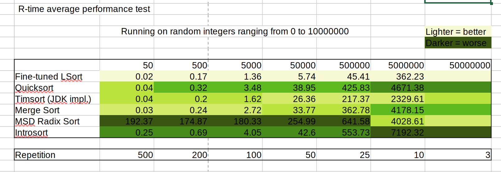

# LSort

Here is a Java implementation of the LSort algorithm, which is asymptotically 10x faster than the basic Quicksort implementation.

## :warning: WARNING

This repository is intentionally created with NO LICENSE. The [elucidation](https://docs.github.com/en/repositories/managing-your-repositorys-settings-and-features/customizing-your-repository/licensing-a-repository) below is posted by GitHub:

> However, without a license, the default copyright laws apply, meaning that you retain all rights to your source code and no one may reproduce, distribute, or create derivative works from your work.

You can cite this repository without violating the above policy. Please check the "Cite this repository" button.

## Introduction

LSort is a hybrid sorting algorithm using [MSD radix sort](https://en.wikipedia.org/wiki/Radix_sort#Most_significant_digit,_forward_recursive) and [Merge-insertion sort](https://en.wikipedia.org/wiki/Merge-insertion_sort). On relatively small arrays, LSort fall back to Insertion sort. For larger ones, it first uses MSD radix sort to scale down the subarrays, then turn to Merge-insertion sort.

The specific implementation in this repository is concurrent.

## Performance

LSort uses MSD radix sort to reduce the number of recursions. This allows it to have average runtime $\displaystyle \Theta \left( N + \frac1K \log N \right)$ and worst-case runtime $O \left( N^2 \right)$. 

  
Performance of the Java implementation in this repository: 

  
  ### Environment
  * CPU: AMD Ryzen 7 7840HS w/ Radeon 780M Graphics (16) @ 3.800GHz
  * OpenJDK: 20.0.2

